# PhenoTag: Understanding Phenological Image Annotation

*A beginner's guide to phenological annotation with PhenoTag*

## What is PhenoTag?

PhenoTag is a tool designed to help scientists annotate images from phenocams (specialized cameras that monitor seasonal changes in vegetation). These annotations help researchers track important environmental changes like:

- When plants start growing leaves in spring
- When flowers bloom
- When leaves change color in autumn
- When snow covers the landscape

## Why Do We Need It?

Imagine you're a scientist trying to understand how climate change affects plant life cycles. You've set up cameras at different research stations that take pictures every day, but now you have thousands of images! PhenoTag helps you:

1. Organize these images by location and date
2. Mark important details in each image
3. Track your progress as you work through large datasets
4. Share your observations with other researchers

## How PhenoTag Works

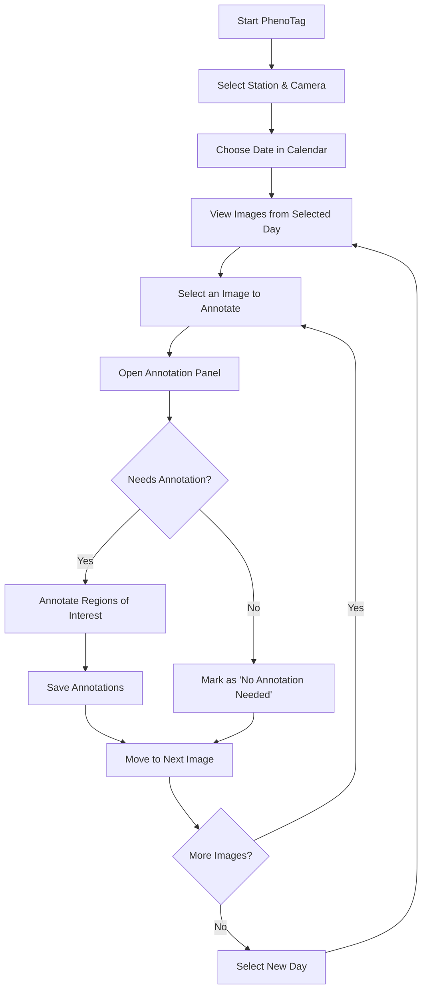

## Key Concepts

### 1. Regions of Interest (ROIs)

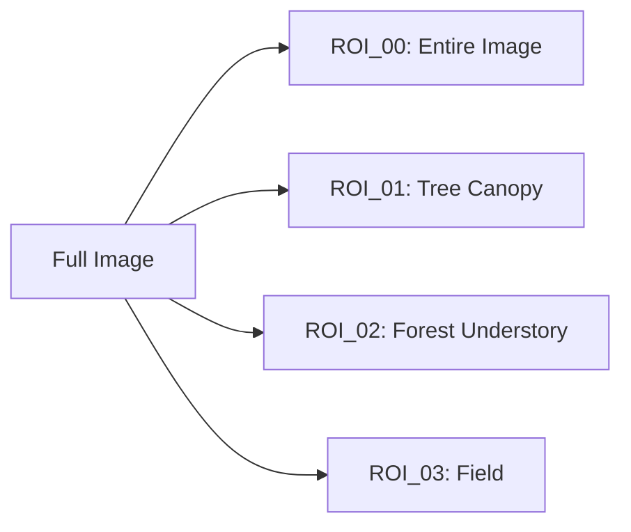

ROIs are specific areas in an image that scientists want to track. For example:
- **ROI_00** always represents the entire image
- **ROI_01** might be a specific tree canopy
- **ROI_02** could be an area of shrubs
- **ROI_03** might be a field of grass

By separating the image into regions, scientists can track how different parts of the ecosystem change throughout the seasons.

### 2. Annotation Process

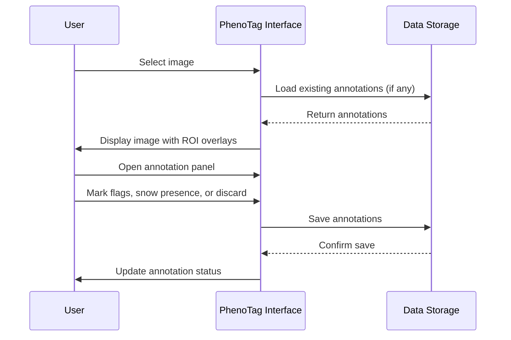

When annotating an image, you can mark:
- **Quality flags**: Issues like "cloudy," "too bright," or "shadows"
- **Snow presence**: Whether snow appears in the ROI
- **Discard**: If the ROI should be excluded from analysis (e.g., camera malfunction)

### 3. Data Organization

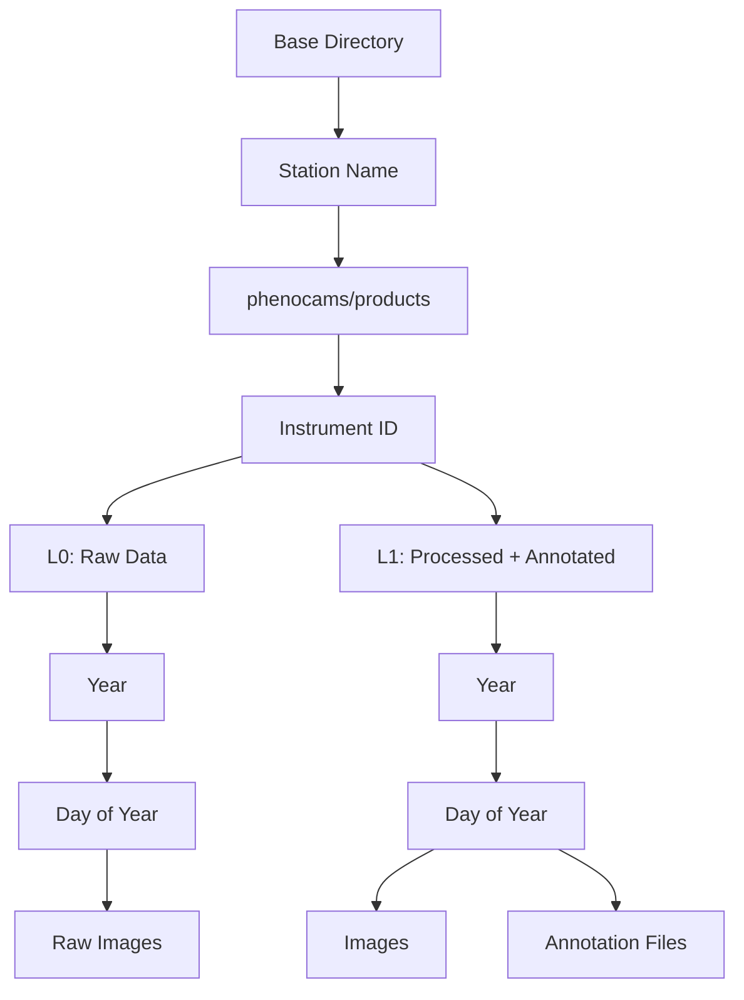

PhenoTag organizes data in a structured way:
- Images are stored by station, instrument, year, and day
- Data is divided into L0 (raw) and L1 (processed) levels
- Annotations are saved alongside images in the L1 directory
- Each day has its own annotation file
- A central file tracks overall annotation progress

## Example Workflow: Annotating Spring Growth

Let's follow Jane, a researcher studying spring leaf growth at Abisko station:

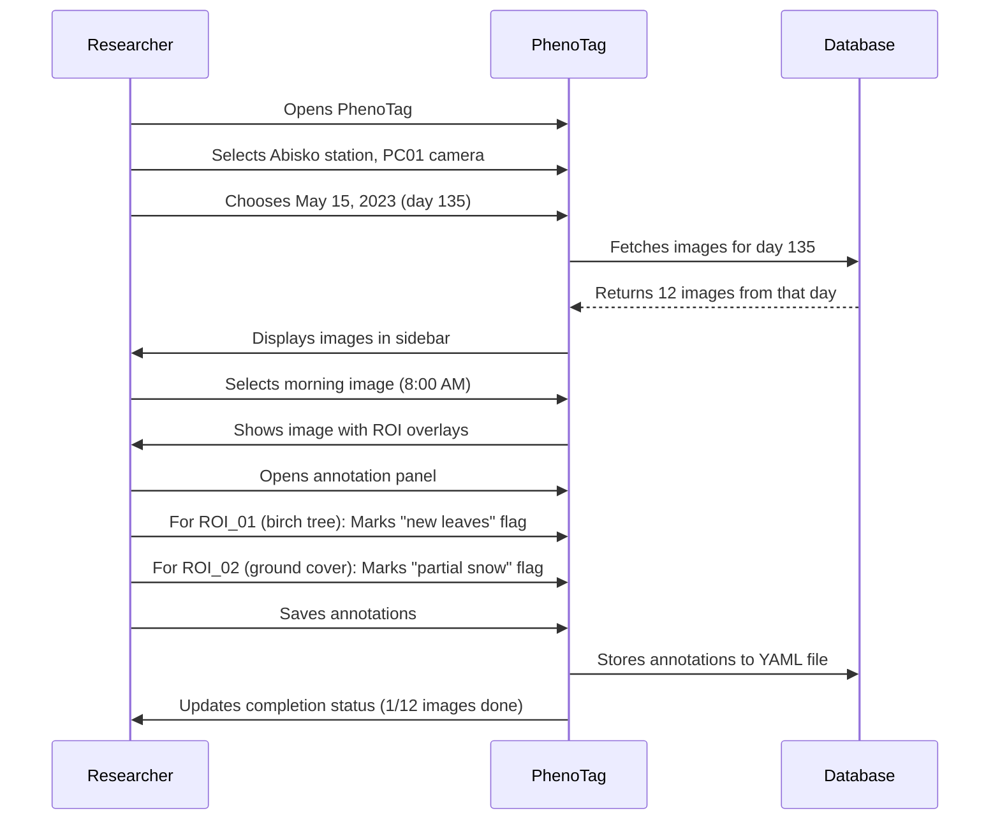

## How PhenoTag Saves Your Work

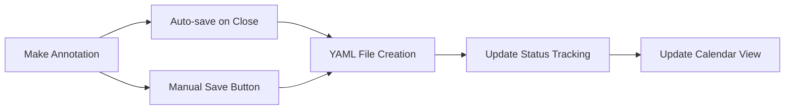

PhenoTag automatically saves your annotations:
- When you close the annotation panel
- When you switch to a different image
- When you click the save button
- When you mark an image as "No annotation needed"

## The Annotation Timer

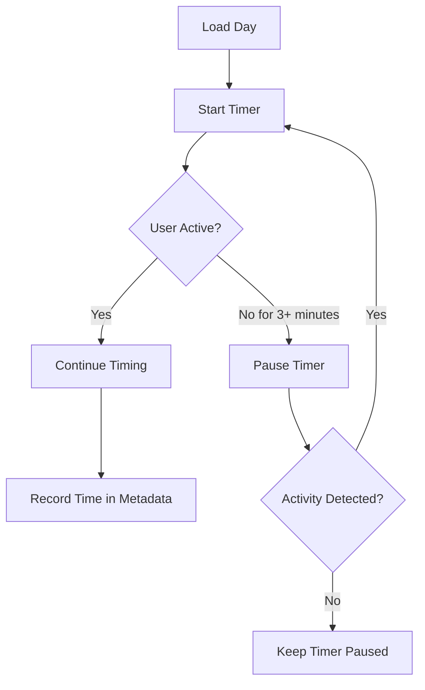

PhenoTag also tracks how much time you spend annotating:
- The timer starts when you load a day of images
- It pauses if you're inactive for 3 minutes
- It resumes when you start working again
- The total time is saved with your annotations

## Understanding the Interface

### Main Elements

```mermaid
flowchart TB
    subgraph Sidebar
        A[Station Selection]
        B[Instrument Selection]
        C[Calendar View]
        D[Image Selection]
        E[ROI Toggle]
        F[Annotation Panel Button]
    end
    
    subgraph Main Content
        G[Current Image Display]
        H[ROI Overlays]
        I[Annotation Summary]
        J[Progress Metrics]
    end
    
    Sidebar --> Main Content
```

The interface is divided into two main sections:
1. **Sidebar**: For selecting what to view and annotate
2. **Main Content**: For viewing images and their annotations

### Annotation Panel

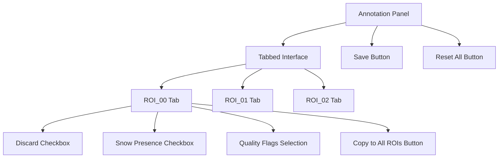

The annotation panel appears when you click "Annotate" or "Edit":
- Each ROI has its own tab
- You can mark discard status and snow presence
- You can select multiple quality flags
- You can copy settings from ROI_00 to all other ROIs
- Changes are saved when you close the panel or click save

## Practical Tips

### Managing Large Datasets

When working with thousands of images:
1. Use the calendar view to track your progress
2. Look for days with colored indicators showing completion status
3. Focus on one month at a time to stay organized
4. Take breaks to prevent annotation fatigue

### Consistency in Annotations

For reliable scientific data:
1. Use the same criteria for all similar images
2. When in doubt, refer to annotation guidelines
3. Use the "Copy ROI_00 Settings to All ROIs" feature when appropriate
4. Review your work periodically to ensure consistency

## Understanding L0 and L1 Data

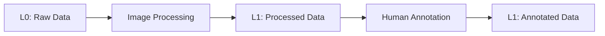

In the SITES Spectral ecosystem, data goes through different processing levels:

### L0 Data: Raw Images

L0 refers to raw phenocam images with minimal processing:
- Original images directly from the camera
- Standard naming format: `{location}_{station}_{instrument}_{year}_{day}_{timestamp}.jpg`
- Example: `abisko_ANS_FOR_BL01_PHE01_2022_181_20220630_113454.jpg`
- Stored in L0 directory structure

### L1 Data: Processed and Annotated

L1 data is created through several steps:

1. **Time-Window Filtering**: Only images within a specific time window are selected
   - Default time window is 09:00-15:00 (local time)
   - Ensures images are captured during optimal daylight conditions
   - Focuses on images when phenological features are most visible

2. **Sun Position Calculation**: Advanced sun calculations are performed
   - Sun altitude and azimuth are determined for each image
   - Time from solar zenith (highest sun position) is calculated
   - A light quality index is computed based on sun position

3. **Image Processing**: The original L0 images undergo processing
   - Files are copied to the L1 directory structure
   - Each image is assigned a unique L1 identifier (GUID)
   - Original filename structure is preserved
   - Image metadata is extracted and enhanced

4. **Database Integration**: All processed images are cataloged
   - Processed images are tracked in an L1 database
   - Images can be blacklisted to exclude poor quality data
   - Processing statistics are maintained for monitoring

5. **Annotation Addition**: Scientists add valuable metadata
   - Region of Interest (ROI) definitions are applied
   - Quality flags are added to indicate image conditions
   - Snow presence is marked when relevant
   - Discarded images are flagged

6. **Metadata Integration**: Additional information is stored alongside images
   - Tracking of annotation progress
   - Recording time spent on annotations
   - Completion status for days and months

The L1 data combines the processed images with human annotations, creating a more valuable dataset for scientific analysis. This combination of automated processing and expert human annotation makes the data more useful for tracking environmental changes.

## Advanced Data Processing: L2 and L3 Data

While annotating images with PhenoTag is valuable, the real scientific power comes from the advanced processing steps that transform these annotated images into meaningful ecological data. Let's explore how the L2 and L3 processing steps add even more value to the phenological data.

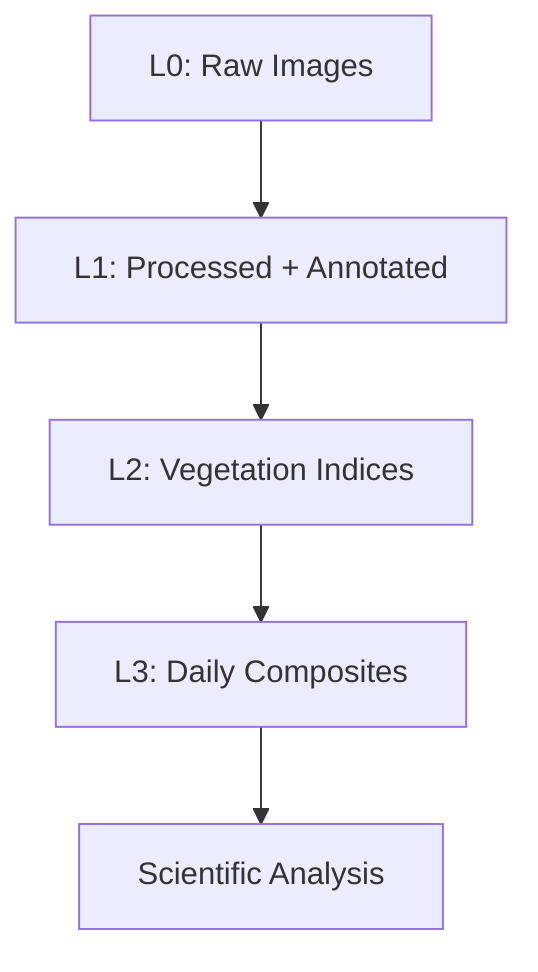

### L2 Data: Vegetation Indices

L2 processing extracts important ecological information from images:

1. **Color Band Extraction**: The L2 processor separates the red, green, and blue color channels from each image into separate files.
   - This allows scientists to work with individual color components
   - Makes it possible to calculate specialized vegetation metrics

2. **Vegetation Index Calculation**: L2 processing computes several important vegetation indices:
   - **GCC (Green Chromatic Coordinate)**: Measures the "greenness" of vegetation (G / (R+G+B))
   - **RCC (Red Chromatic Coordinate)**: Helps identify fall coloration or stress (R / (R+G+B))
   - **BCC (Blue Chromatic Coordinate)**: Used in certain vegetation analyses (B / (R+G+B))
   - **EGI (Excess Green Index)**: Enhances green vegetation features (2G - R - B)
   - **VARI (Visible Atmospherically Resistant Index)**: Minimizes lighting variation effects ((G - R) / (G + R - B))
   - **GRVI (Green-Red Vegetation Index)**: Identifies health changes ((G - R) / (G + R))
   - **NGBVI (Normalized Green-Blue Vegetation Index)**: Useful for certain vegetation types ((G - B) / (G + B))

3. **Database Tracking**: All calculated indices are recorded in a database with metadata
   - Maintains connections to original L1 images
   - Preserves quality information from annotations
   - Enables traceability throughout the scientific process

### L3 Data: Daily Composites

L3 processing creates reliable daily summaries of vegetation conditions:

1. **Daily Mean Calculation**: Combines all images from a single day into one representative value
   - Reduces noise from individual images
   - Creates more stable measurements
   - Makes it easier to track changes over seasons

2. **Weighted Means**: Uses annotation quality information for smarter averaging
   - Takes advantage of the human annotations from PhenoTag
   - Gives less weight to images with poor quality flags
   - Considers solar position when weighting images (better sun = higher weight)
   - Creates more reliable metrics by reducing the impact of problematic images

3. **ROI Time Series**: Extracts vegetation index values for each Region of Interest
   - Creates time series data for each specific ROI (tree canopy, understory, etc.)
   - Exports data in CSV format for statistical analysis
   - Enables tracking of different ecosystem components separately

4. **Data Integration**: Combines data from multiple images and days
   - Fills gaps in time series
   - Enables long-term monitoring of seasonal changes
   - Supports climate change research with consistent, high-quality data

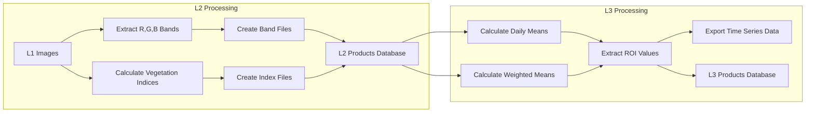

### Why This Matters for Science

These processing steps transform simple camera images into valuable scientific data by:

1. **Reducing Noise**: Multiple images and smart averaging reduce random variations
2. **Adding Context**: Human annotations help identify and manage problematic images
3. **Standardizing Measurements**: Consistent metrics allow comparison across time and locations
4. **Automating Analysis**: Streamlined processing of thousands of images becomes possible
5. **Creating Time Series**: Long-term trends can be reliably tracked and analyzed

The L1, L2, and L3 data processing steps work together to create a powerful tool for scientists studying how ecosystems respond to seasonal changes and climate factors.

## Conclusion

PhenoTag simplifies the complex task of annotating phenological images, helping researchers track environmental changes over time. By organizing images, enabling detailed annotations, and tracking progress, it becomes an essential tool in understanding how ecosystems respond to seasonal changes and climate factors.

The advanced L2 and L3 processing builds on the human annotations to create standardized, reliable scientific data that can be used to track ecosystem changes over time - from daily variations to long-term climate trends.

With PhenoTag's user-friendly interface, even beginners can contribute to important scientific research about our changing environment!