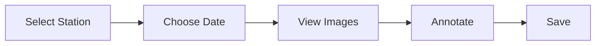

# PhenoTag Quick Start

Get PhenoTag running in under 2 minutes.

## Prerequisites

- Python 3.12+
- `uv` package manager

## Installation

```bash
# Clone or navigate to the project directory
cd /path/to/phenotag

# Create and activate virtual environment
uv venv --python 3.12
source .venv/bin/activate

# Install dependencies
uv pip install -e .
```

## Running PhenoTag

```bash
# Activate environment (if not already active)
source .venv/bin/activate

# Run the application
phenotag run
```

> [!tip] Quick Launch Options
> - `phenotag run --browser` - Opens in your default browser automatically
> - `phenotag run --port 8502` - Use a custom port
> - `phenotag run --host 0.0.0.0` - Make accessible on network

## Access the Application

Once running, open your browser to:

```
http://localhost:8501
```

## Basic Workflow



1. **Select Station** - Choose from the sidebar dropdown
2. **Choose Date** - Use the calendar to pick a day
3. **View Images** - Browse images from that day
4. **Annotate** - Click "Annotate" to open the panel
5. **Save** - Annotations auto-save on close

> [!note] First Time Setup
> Ensure your `stations.yaml` configuration file is properly set up with your phenocam stations before starting.

## CLI Commands Reference

| Command | Description |
|---------|-------------|
| `phenotag run` | Start the web application |
| `phenotag run --help` | Show all available options |
| `phenotag images default-roi <image>` | Generate default ROI for an image |

## Next Steps

- [[phenotag_for_beginners|Complete Beginner's Guide]] - Full walkthrough with visuals
- [[ui_guide|UI Guide]] - Detailed interface reference
- [[popup_annotation_workflow|Annotation Workflow]] - Step-by-step annotation process

---

> [!info] Need Help?
> Check the [[../README|Documentation Index]] for comprehensive guides and API references.
